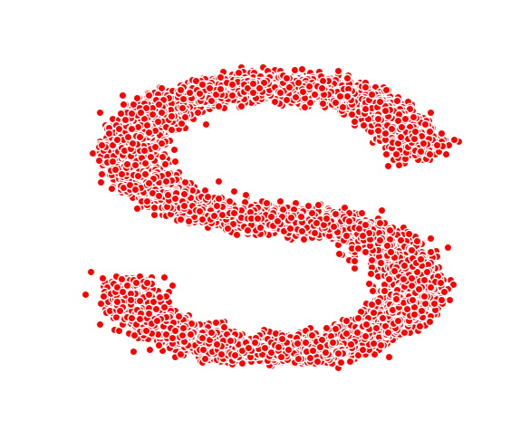
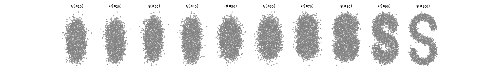

# DDPM for 2D point cloud

It is a implementation of DDPM for 2D point cloud.

For dataset:
We generate the dataset by ourself. You can generate the dataset by running the Dataset_generator.py.

This image is the sample image we generate.

For train:
The code is in the Train.py file. The model we use is a simple MLP instead of U-net. The model is supposed to converge 
for about 1000 epoch. You can run this file for training.

For Infer:
The training process is separated from inference process. After implemented Train.py, weight of the model "save.pt" will
generated. You can choose a specific weight for inference in Infer.py. After infering process, we will also print the loss
and the epoch for the training of the weight. 

For Config:
You can change the num_step and hyperparameters in Config.py file.

Reference:
https://github.com/azad-academy/denoising-diffusion-model
